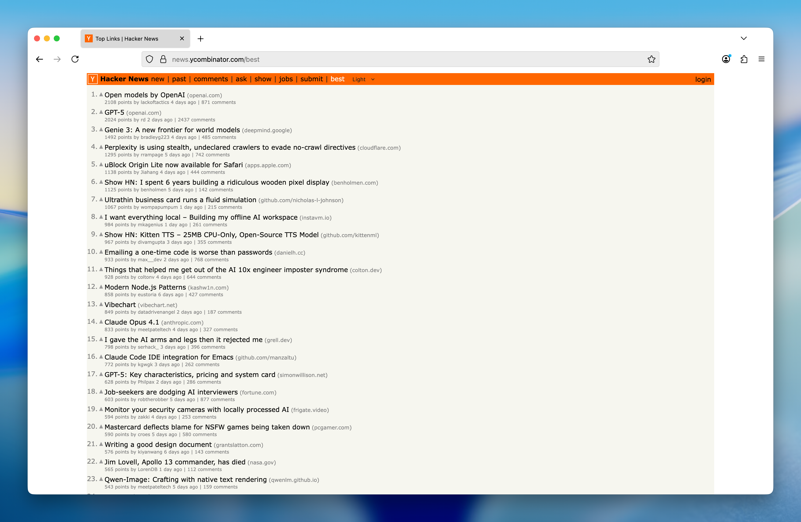
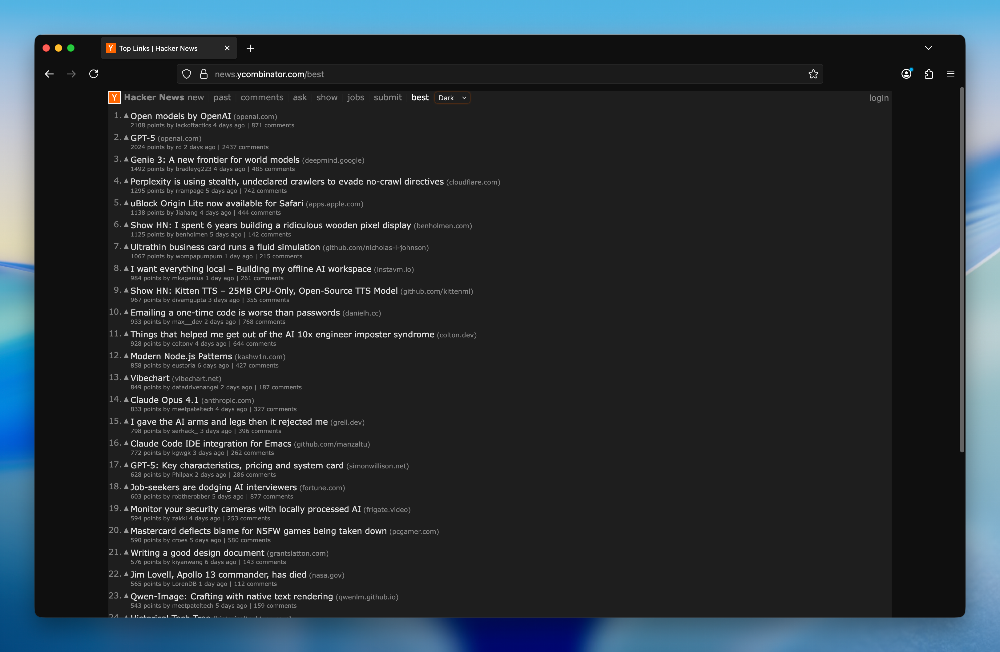

# Hacker News Theme Switcher

Simple Firefox add-on to switch Hacker News between Light, Dark, or System theme. Adds a small dropdown. Nothing else.

## Install

Firefox Add-ons: https://addons.mozilla.org/en-US/firefox/addon/hacker-news-theme-switcher/

### Manual (temporary) install

1. Clone this repo
2. Open `about:debugging` → This Firefox → Load Temporary Add-on
3. Pick `src/manifest.json`

## Features

- Light / Dark / System modes
- Saves your choice
- System option tracks OS theme changes

## Screenshots

|             Light             |            Dark             |
| :---------------------------: | :-------------------------: |
|  |  |

## How it works

`content.js` injects a `<select>` and toggles a `hn-dark-theme` class. `matchMedia('(prefers-color-scheme: dark)')` is used for System mode.

## Permissions

Uses only `storage` to remember the selected theme. No network, no tracking.

## License

MIT (see `LICENSE`).
